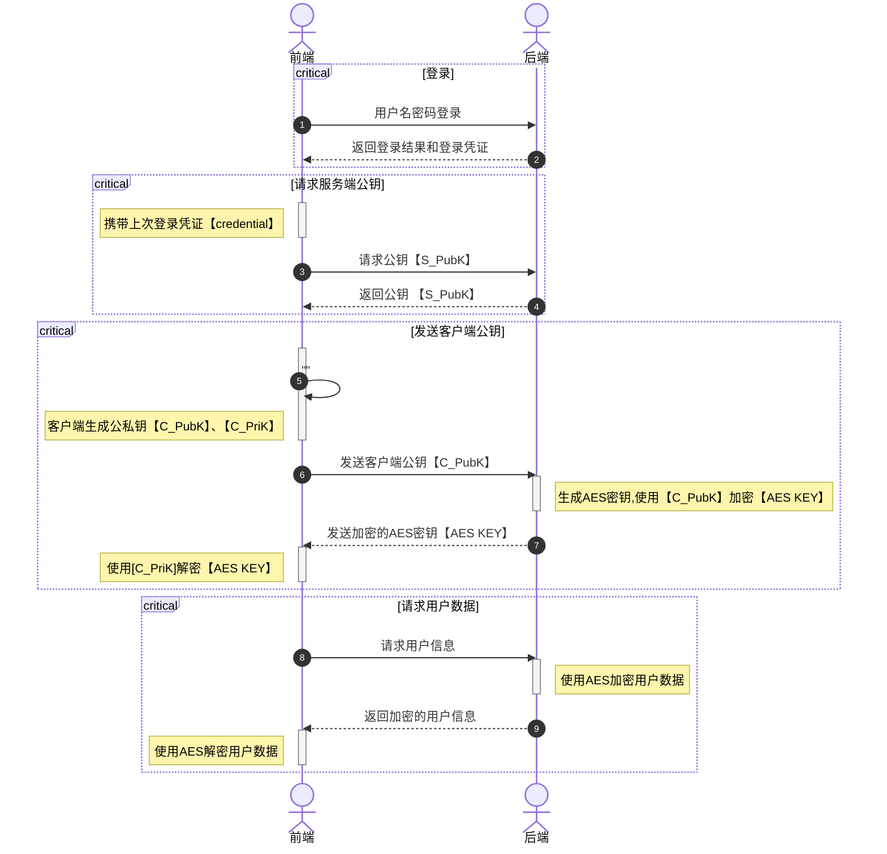

```mermaid
sequenceDiagram
    actor  A as 前端
    actor  B as 后端
    autonumber
    critical 登录
    A ->> B: 用户名密码登录
    B -->> A: 返回登录结果和登录凭证
    end
    critical 请求服务端公钥
        activate A
        note left of A: 携带上次登录凭证【credential】
        deactivate A
        A ->> B: 请求公钥【S_PubK】
        B -->> A: 返回公钥 【S_PubK】
    end
    critical 发送客户端公钥
        activate A
        A ->> A: ""
        note left of A: 客户端生成公私钥【C_PubK】、【C_PriK】
        deactivate A
        A ->> B: 发送客户端公钥【C_PubK】
        activate B
        note right of B: 生成AES密钥,使用【C_PubK】加密【AES KEY】
        deactivate B
        B -->> A: 发送加密的AES密钥【AES KEY】
        activate A
        note left of A: 使用[C_PriK]解密【AES KEY】
        deactivate A
    end
    critical 请求用户数据
        A ->> B: 请求用户信息
        activate B
        note right of B: 使用AES加密用户数据
        deactivate B
        B -->> A: 返回加密的用户信息
        activate A
        note left of  A: 使用AES解密用户数据
        deactivate A
    end
```